# Project01 - Make gpid Systemcall

## 첫 번째 프로젝트입니다. 크게 4 부분으로 나뉘고, 각각의 단계에 대해서 기술해놓았습니다.

* Design
  * 명세에서 요구하는 조건에 대한 구현 계획을 서술하고 있습니다.
* Implement
  * 새롭게 구현하거나 수정한 부분이 기존과 어떻게 다른지, 해당 코드의 목적이 무엇인지에 대해 구체적으로 서술하고 있습니다.
* Result
  * 컴파일 및 실행과정과, 명세의 요구부분이 정상적으로 동작하는 실행결과를 첨부하고, 동작 과정에 대해 설명하고 있습니다.
* Trouble shooting
  * 과제 수행 과정에서 겪은 문제와, 해당 문제와 해결 과정을 서술하고 있습니다.
 

---

### Design

* 우리는 gpid 시스템 콜을 구현할 것입니다.
* gpid 시스템 콜은 현재 프로세스의 부모의 부모, 즉 조부모의 pid를 호출하는 시스템 콜입니다.
* 이 시스템콜을 구현하기 전에, 먼저 xv6의 시스템 콜엔 어떤게 있는지 살펴봅시다.
* xv6의 파일 내부는 다음과 같이 이루어져 있습니다.
  * ```shell
     $ ls
  * 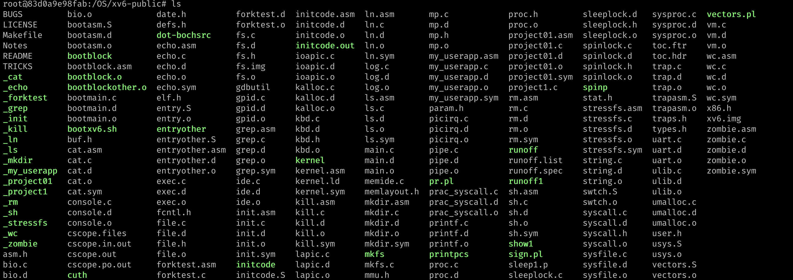
* 자, 이제 xv6의 파일 내부에서 syscall.h를 열어봅시다. 이 파일안엔 xv6 내부에서 쓸 수 있는 시스템콜이 내장되어 있을 겁니다.
  * ```shell
     $ vim syscall.h
  * 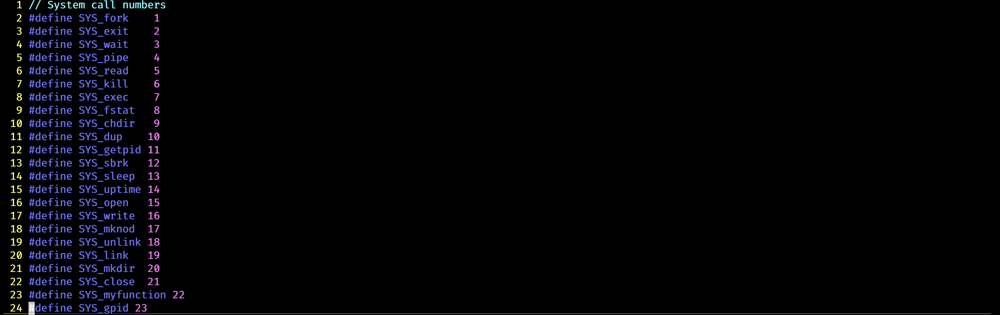
  * 확인해보니, 현재 프로세스 아이디를 불러올 수 있는 getpid()라는 시스템콜이 이미 구현되어있는걸 확인할 수 있습니다.
  * getpid()함수를 통해 gpid를 구현할 수 있을테니, 저희는 이전에 깔았던 cscope를 활용하여 getpid()가 어디서 호출되어 있고, 어떻게 구현되어 있는지 확인해 봅시다.
* vim의 Command모드에서 **:cs find c getpid** 를 입력해 getpid()함수가 어디서 호출되어있는지 확인해보고, **:cs find s getpid** 를 입력해 getpid가 어디서 심볼로 확인되어있는지 확인해 봅시다.
  * 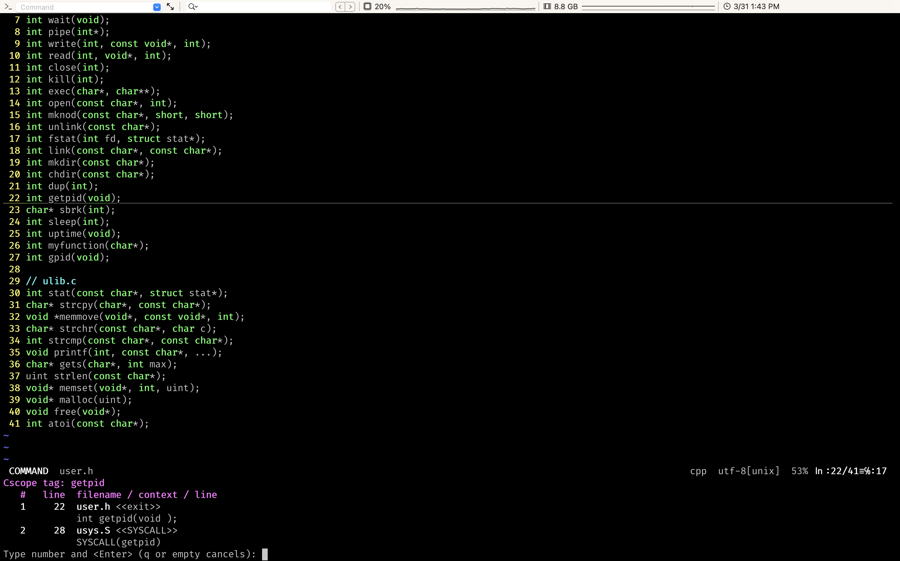
  * 확인해보니, getpid는 user.h안에서 함수를 호출하고 있고, user.h는 다양한 곳에서 호출되고 있습니다. 자 일단, syscall.h안에 getpid가 있으니, syscall.h를 include 하고 함수를 찾아봅시다
  * 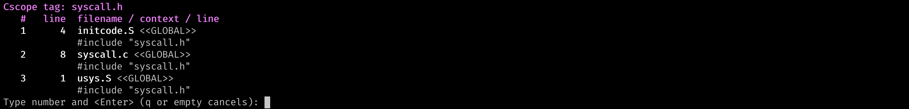
  * syscall.c에서 syscall.h를 호출하고 있군요. 자, 그럼 syscall.c를 살펴봅시다.
  * 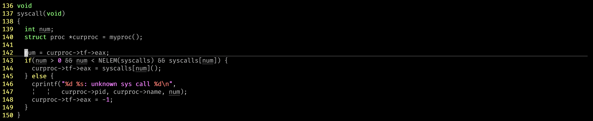
  * 맨 끝의 함수에서, pid라는 변수를 사용하는걸 볼 수 있고, 이 pid가 저희가 알고있는 process id가 되겠군요. 이 함수를 본격적으로 분석해봅시다.
* pid는 curproc라는 구조체에서 가져오고, 이 curproc는 myproc()이라는 함수를 통해 값을 받고 있습니다. 그럼, 이 myproc()함수를 뜯어보면 되겠군요.
* **:cs find d myproc**으로 검색하면 myproc()은 proc.c라는 함수 안에 있음을 알 수 있습니다.
  * 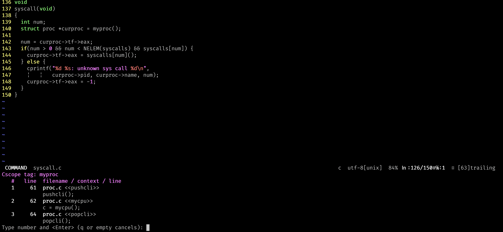
  * 자 그럼, proc.c를 들어가봅시다. myproc()은 함수고, 여기서 proc라는 구조체를 사용하고 있군요. myproc는 포인터 구조체를 반환하고 있습니다. 그럼 이 proc라는 구조체를 분석하면 답을 얻을 수 있을 듯 합니다.
  * **:cs find g proc**으로 검색해보면, proc구조체는 proc.h라는 파일 안에 정의되어 있습니다.
  * 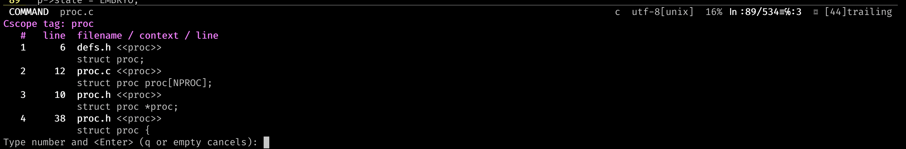
  * 그럼, proc.h라는 파일 안을 들어가보면 되겠습니다. vim으로 proc.h를 켜봅시다.
  * 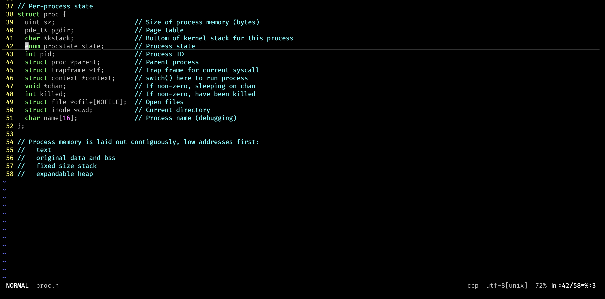
  * proc구조체를 뜯어봅시다. proc구조체 안에 pid가 존재하고, 여기서 parent process구조체를 불러올 수 있겠군요.
  * 그럼 myproc()함수로 내 프로세스를 불러온 다음, myproc()->parent->parent가 내 조부모의 process고 여기서 ->pid를 한다면 내 조부모의 pid를 얻을 수 있겠군요!
  * 자 이제 그럼 구현만 하면 끝날 것 같습니다!
    
---

### Implement

* Design이 끝났으니, 이제 구현만 하면 됩니다.
* 파일 이름은 gpid.c로 하면 될 것 같고, 이건 Project01로 불러오는 것이니 project01.c라는 파일도 필요하겠군요.
* gpid.c를 먼저 만들어 봅시다
  * 아까 Design대로, myproc()->parent->parent->pid만 하면 끝나겠군요.
  * 헤더파일을 잘 불러오는게 중요할 것 같습니다.
  * ```c
     int gpid() {
       int pid = myproc()->parent->parent->pid;
       return p;
     }
  * gpid구현은 이걸로 끝입니다. 다만 나의 Wrapper function이 필요할 것 같습니다. 실습에서 따라해본 대로 Wrapper function을 만들어 봅시다.
  * ```c
     //Wrapper function for my gpid
     int sys_gpid(void) {
       int pid = myproc()->pid;
       if(pid < 0)
         return -1;
       return gpid();
    }
  * 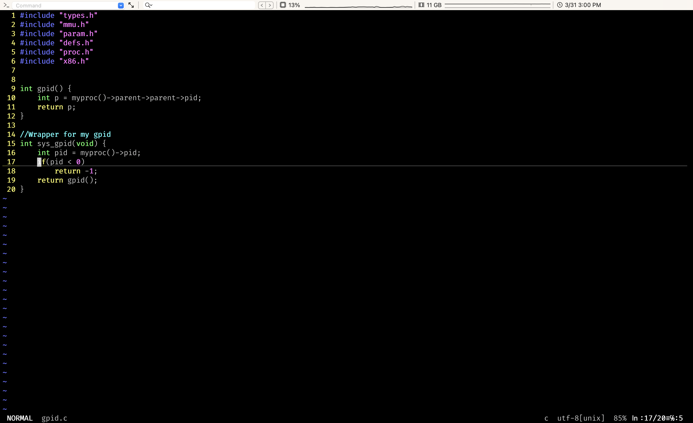
* 자, Wrapper function까지 끝났습니다. 이제 설정 파일만 추가하면 되겠군요.
  * 먼저 Makefile를 열어봅시다
  * Makefile의 OBJS 밑에 저희의 시스템 콜을 넣읍시다.
  * 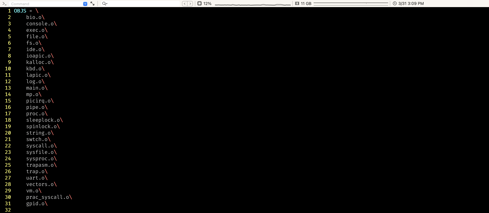
  * ```shell
     $ make clean
     $ make | grep gpid
  * 여기까지 끝냈다면 성공적으로 make를 해, gpid.o파일이 생겼을 겁니다.
  * 그 다음, defs.h, syscall.h, syscall.c에 저희의 gpid 시스템 콜을 추가해 줍시다
  * 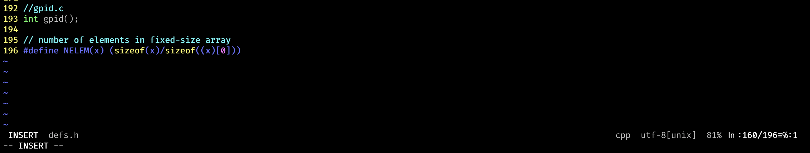
  * 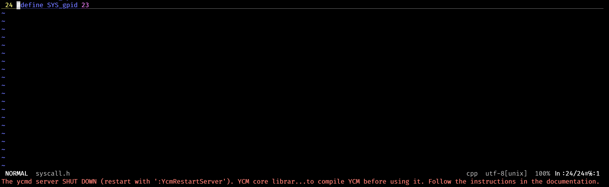
  * 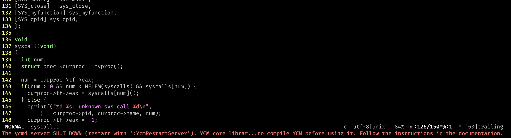
  * 마지막으로 user.h 와 usys.S에 설정을 추가해주면 끝납니다.
  * 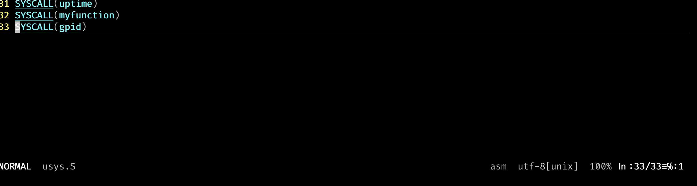
  * 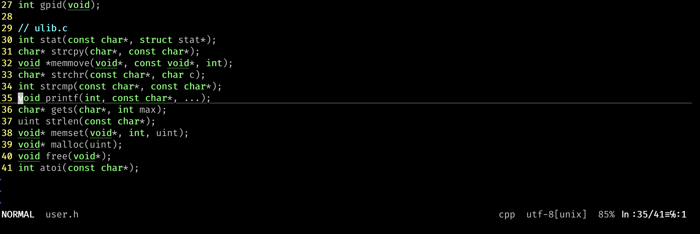
 
* 이제 project01.c 파일만 만들어 저희의 앱으로 만들면 되겠네요!
  * project01.c를 다음과 같이 만들어 줍시다
  * 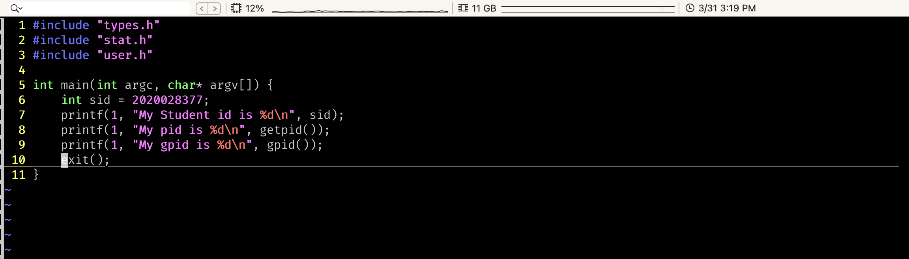
  * 마지막으로 Makefile에 설정만 추가해봅시다!
  * 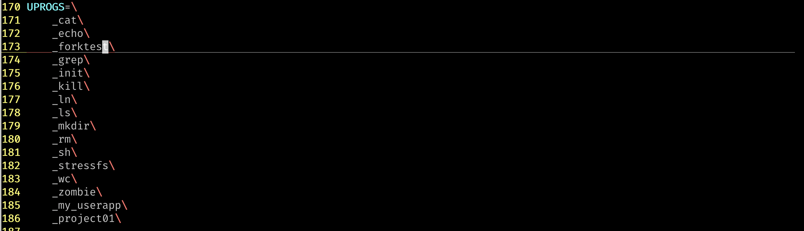
  * 마지막으로 make만 해줍시다!
  * ```shell
     $ make clean
     $ make
     $ make fs.img
  * 오류가 나지 않고 성공적으로 make가 된다면 이제 모두 끝입니다!

---

### Result
* 이제 구현이 끝났습니다!
* 실행이 잘 되는지 확인해보겠습니다.
  * 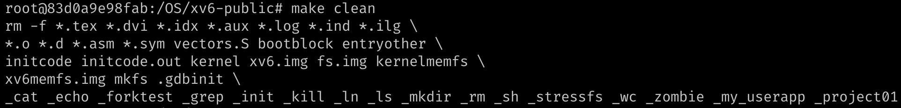
  * 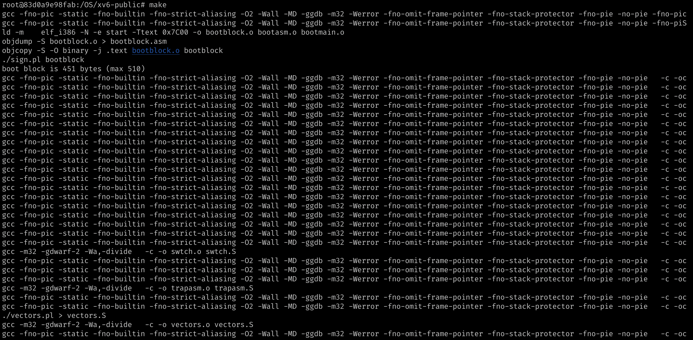
  * 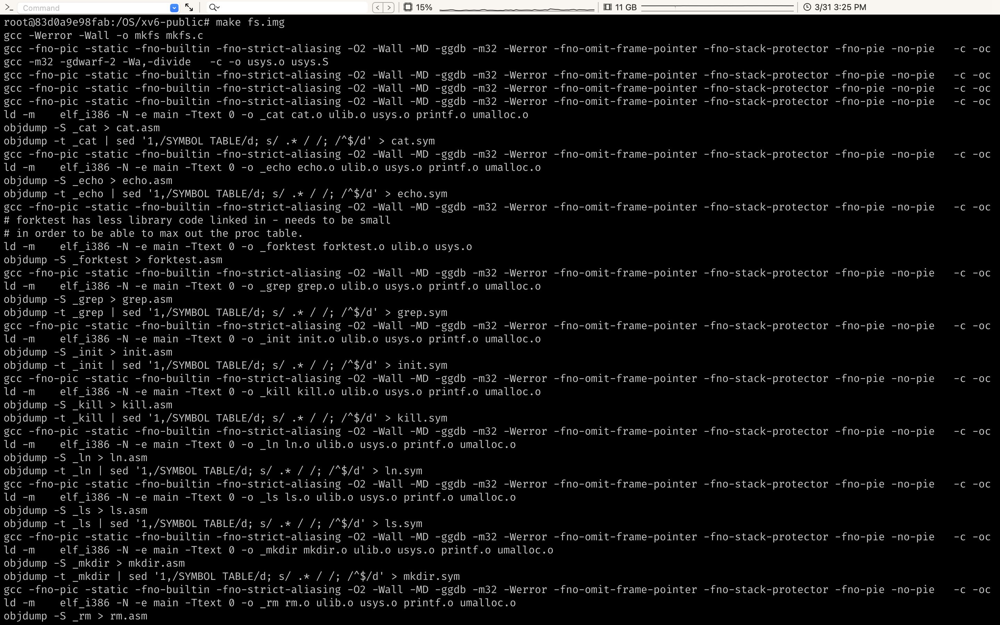
* 이제 xv6를 켜봅시다.
  * ```shell
     $ ./bootxv6.sh
  * ```shell
     $ project01
  * 다음과 같이 실행된다면 성공적으로 만들어진 것 입니다!
  * 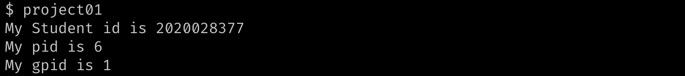


---

### Trouble shooting.

* 개인적으로 힘들었던 점은 역시 **cscope**사용법이었습니다.
* 자주 쓰던 방법이 아니니 좀 어려웠네요. 하지만 실습과제와 구글링을 통해 해결했습니다.
* 특히 **:cs find s ~, :cs find c ~, :cs find d ~**방법이 꽤나 좋았습니다.
* 이 화면만 질리게 봤습니다.
* 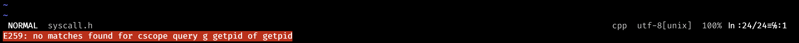

* 두 번째로 힘들었던 점은 헤더 파일이었습니다
* 헤더 파일이 순서가 꼬여서 자꾸 에러가 났었습니다.
* 여기 고치는데 꽤나 많은 시간을 썼습니다.
* 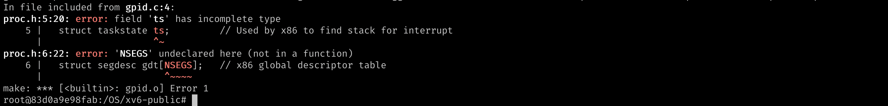
* cscope를 이용해 ts가 어디있는지 보고, 헤더 파일의 위치를 수정하여 해결하였습니다.
* 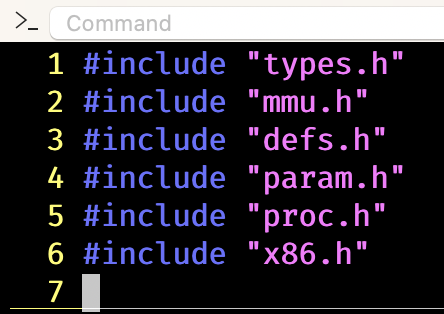
* 오류를 해결한 모습입니다.
* 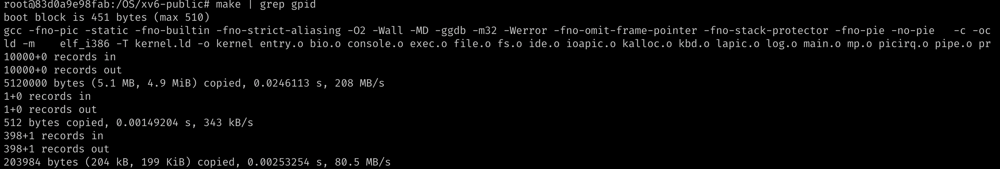

---